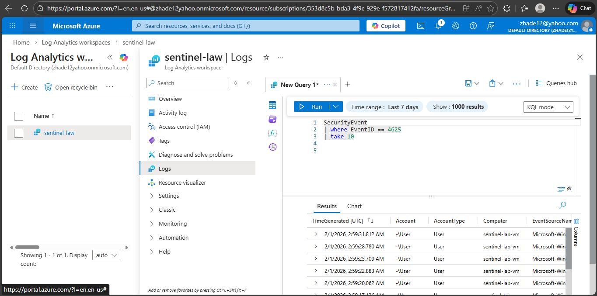

# Julia Afon – SOC Analyst Portfolio

Welcome to my SOC Analyst portfolio.

This repository showcases hands-on cybersecurity projects focused on:

• Microsoft Sentinel (SIEM)  
• Alert triage and incident investigation  
• Windows Security Event analysis  
• KQL log queries  
• Azure Virtual Machines  
• Vulnerability Management (Qualys VMDR)

---

## 🔐 SOC Lab – Azure Sentinel (SIEM)

Built a hands-on SOC lab using Microsoft Azure and Sentinel to practice:

• Ingesting Windows Security Events  
• Creating analytics rules  
• Investigating alerts  
• Performing incident triage  
• Querying logs with KQL  
• Detecting authentication failures (Event ID 4625)

### Tools Used
- Microsoft Azure  
- Microsoft Sentinel (SIEM)  
- Log Analytics  
- KQL  
- Windows Event Logs  

---

## 📸 Lab Evidence

(Screenshots coming soon)

---

## 🔗 Connect With Me

LinkedIn: https://www.linkedin.com/in/julia-afon

## Azure Sentinel SOC Lab

## About Me

SOC Analyst with hands-on experience using Microsoft Sentinel SIEM for alert triage, log analysis, incident investigation, and vulnerability management. Passionate about security operations and continuously improving practical SOC skills.
